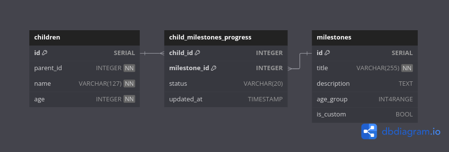

# KidzPAN Milestone Tracker API

    Backend assignment for KidzPAN — Implements REST APIs to manage Children’s Milestones.


---
## 1. Tech Stack

- Node.js + Express
- PostgreSQL
- Schema and Seeding Data in SQL
- Docker for Containerization


---
## 2. Project Structure

```
kidzpan-tech-assignment/
└── server/
    ├── controllers/
    ├── db/
    ├── middleware/
    ├── models/
    ├── routes/
    ├── server.js
    └── README.md
```

---
## 3. Setup Instructions

### 1. Manually

#### 1. Clone the repo and Install Dependencies

```bash
git clone --depth=1 https://github.com/kp0010/kidzpan-tech-assignment 
cd kidzpan-tech-assignment/server

npm install --omit=dev
```

#### 2. Set up the PostgreSQL database
* Create a Database in PostgreSQL (eg. kidzpan)
* Update .env file:

```bash
DATABASE_USER = postgres
DATABASE_HOST = localhost
DATABASE_DB   = kidzpan
DATABASE_PORT = 5432
DATABASE_PW   = ******** 
```

#### 3. Run the Schema and Seed scripts

```bash
psql -U postgres -d kidzpan -f ./db/schema.sql
psql -U postgres -d kidzpan -f ./db/seed.sql
```

---

---

#### 4. Run the Server
```bash
node server.js
```
or 
```bash
npm run start
```

### 2. Using Docker

#### 1. Build Image

```bash
docker build -t kidzpan_server:latest .
```

#### 2. Run Image

```bash
docker run -d --network host --name kidzpan_server kidzpan_server:latest 
```

---
## 4. API Endpoint

### 1. GET /milestones/:child_id
* Returns All the Relevant Milestones of a Child

* Example Request:
```bash
curl -X GET "localhost:8080/milestones/1"
```

* Example Response:

```json
{
  "success": "success",
  "message": "Retrieved Milestones Succesfully",
  "data": [
    {
      "id": 1,
      "title": "Speak 2 words",
      "description": "Child can say words like “mama”, “dada”.",
      "age_group": "[2,3)",
      "is_custom": false,
      "status": "complete",
      "updated_at": "2025-06-12T16:48:31.413Z"
    },
    {
      "id": 2,
      "title": "Walk unassisted",
      "description": "Child walks without support.",
      "age_group": "[2,3)",
      "is_custom": false,
      "status": "in_progress",
      "updated_at": "2025-06-12T16:57:11.435Z"
    }
  ]
}
```

### 2. PUT /milestones/custom/:child_id
* Adds a Custom Milestones for a Child

* Example Request:
```bash
curl -X PUT http://localhost:8080/milestones/custom/1 \
  -H "Content-Type: application/json" \
  -d '{
    "title": "Knows colors",
    "description": "Child can identify basic colors"
  }'
```

* Example Response:

```json
{
  "success": "success",
  "message": "Added Milestone Successfully",
  "data": {
    "id": 12,
    "title": "Knows colors",
    "description": "Child can identify basic colors",
    "age_group": null,
    "is_custom": true
  }
}
```

### 3. POST /progress/
* Adds a Custom Milestones for a Child

* Example Request:
```bash
curl -X POST http://localhost:8080/progress \
  -H "Content-Type: application/json" \
  -d '{
    "childId": 1,
    "milestoneId": 8,
    "status": "complete"
  }'
```

* Example Response:

```json
{
  "success": "success",
  "message": "Updated Milestone Succesfully",
  "data": {
    "child_id": 1,
    "milestone_id": 8,
    "status": "complete",
    "updated_at": "2025-06-12T16:57:43.285Z"
  }
}
```

---
## 5. Postman Collection

* A kidzpan_api.postman_collection.json file is included.
* Import it into Postman to test all endpoints.

---
## 6. AI Integration

* In future, milestone completion could be auto-validated using Natural Language Processing to extract key actions

---
## 7. Assumptions Made

* Age Group is a range of ages rather than being distinct ages.
* Age Groups are not considered for custom milestones. 
